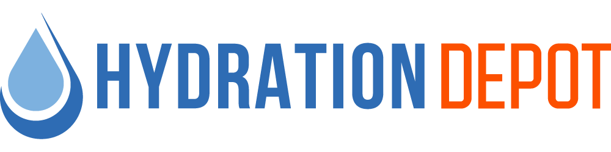

# OES Global — Design System

> **"We're the Find a Way Company."**
> One Design System. Four Diverse Brands.
> [oesglobalinc.com](https://oesglobalinc.com)

This is a **multi-brand** design system: one shared foundation (type, spacing, motifs, components, voice) themed across **five brands** — the OES Global parent plus four sub-brands. Swap one CSS file (or one `data-brand` attribute) and everything re-skins to the chosen brand's palette and logo.

---

## MULTI-BRAND ARCHITECTURE

**One design system. Five themes.** Shared foundations live in `colors_and_type.css`; each brand's palette + logo live in a small theme file under `brands/`.

```
colors_and_type.css        ← shared: fonts, type, spacing, radii, shadows, motifs
                              + the --brand-* token contract (OES defaults on :root)
brands/
  oes-global.css           ← [data-brand="oes"]
  traffic-cones.css        ← [data-brand="tcfl"]
  hydration-depot.css      ← [data-brand="hd"]
  absorbents.css           ← [data-brand="afl"]
  sd2k-valet.css           ← [data-brand="sd2k"]
assets/logos/<brand>/      ← each brand's logo files
```

**The rule:** templates and components reference **semantic `--brand-*` tokens only** — never a raw hex. That's what makes one ad template render correctly in any brand. It also auto-enforces the guideline *"never mix OES palette with sub-brand colors"* — a page can only show one brand's palette at a time.

### How to use a brand
Load the shared CSS, then either set the parent brand globally with `data-brand`, or scope multiple brands on one page:

```html
<link rel="stylesheet" href="colors_and_type.css">
<link rel="stylesheet" href="brands/hydration-depot.css">
<body data-brand="hd">
  <button style="background:var(--brand-primary); color:#fff;">Shop Now</button>
  <header style="background:var(--brand-hero-grad); color:var(--brand-on-dark);">…</header>
   <!-- or just  -->
</body>
```

If you omit `data-brand`, the page uses the **OES Global** defaults baked into `:root`.

### The `--brand-*` contract (every theme provides)
`--brand-name` · `--brand-primary` / `--brand-primary-hover` · `--brand-accent` / `--brand-accent-hover` · `--brand-ink` · `--brand-muted` · `--brand-bg` · `--brand-bg-subtle` · `--brand-border` · `--brand-hero-bg` · `--brand-hero-grad` · `--brand-accent-grad` · `--brand-on-dark` / `--brand-on-dark-muted` · `--brand-logo` / `--brand-logo-dark` / `--brand-icon`. *(HD also exposes extended tokens: `--brand-soft`, `--brand-mid`, `--brand-teal`, `--brand-deep`, `--brand-alert`, `--brand-grad-cool`.)*

### Per-brand reference

| Brand | `data-brand` | Primary | Accent | Hero | Personality |
|---|---|---|---|---|---|
| **OES Global** | `oes` | `#305B7D` | `#7C9CB6` | `#0A2737` | Corporate · authoritative · cool |
| **Traffic Cones For Less** | `tcfl` | `#2E6CB4` | `#FF5100` | `#162750` | Direct · bold · no-nonsense |
| **Hydration Depot** | `hd` | `#5BA6DD` | `#FF5100` | `#004D93` | Clean · fresh · energetic |
| **Absorbents For Less** | `afl` | `#005371` | `#E42845` | `#005371` | Dependable · authoritative |
| **SD2K Valet** | `sd2k` | `#FF5100` | `#D2D2D1` | `#000000` | Bold · premium · confident |

**Shared by all five:** Roboto (primary) · Poppins (secondary/display) · Roboto Condensed (labels). Body text `#232323`, white backgrounds, `#EEEEEE` subtle/divider gray, 8pt spacing, the three motifs, and the same component vocabulary.

> ⚠️ **Logo gap (flagged):** sub-brand logos were supplied as full-color lockups for **light** backgrounds. Reversed/white versions for dark heroes don't exist yet — `--brand-logo-dark` currently falls back to the color lockup (except AFL, which uses its teal drop icon). Provide reversed logos when you need brand lockups on dark sections. Sub-brand SVGs shipped without color data, so the system uses the full-color **PNG** logos.

---

## Company context

**OES Global Inc.** is a parent company. Four specialized brands operate under the OES umbrella, each with its own identity, palette, and market. The OES Global brand itself is the **corporate / family-of-brands** layer — it is deliberately restrained and authoritative, and **its palette is never mixed with sub-brand colors.**

### The OES family

| Brand | Role | Site |
|---|---|---|
| **OES Global** | Parent company · *We Find a Way* | oesglobalinc.com |
| **Traffic Cones For Less** | Safety Supply | trafficconesforless.com |
| **Hydration Depot** | Hydration Solutions | hydrationdepot.com |
| **Absorbents For Less** | Industrial Absorbents | absorbentsforless.com |
| **SD2K Valet** | Valet Services | sd2kvalet.com |

> The OES Global parent palette documented in this section is reserved for the parent brand. Each sub-brand has its own theme under `brands/` — see **Multi-Brand Architecture** above. The visual *motifs* (edge block, layered panels, icon watermark) adapt to any brand palette via the `--brand-*` tokens.

### Sources
- `assets/OES-Brand-Guidelines-2026.pdf` — the master brand book (11 pages); source of truth for the parent brand.
- Sub-brand palettes + logos supplied directly by the client (Jun 2026).
- `assets/oes-logo-source.svg` — original vector logo lockup.
- `assets/oes-icon-mark.png`, `assets/oes-lockup-color.png` — original raster references.

---

## CONTENT FUNDAMENTALS

**Voice:** Confident, plain-spoken, solution-oriented. The master line — *"We're the Find a Way Company"* — sets the tone: capable, resourceful, never boastful. Copy promises **outcomes and reliability**, not hype.

- **Person:** Speaks as **"we"** (the company) to **"you"** (the customer/partner). Collective and accountable.
- **Casing:** **Title Case** for headlines and nav; **Sentence case** for body and supporting copy. Section eyebrows/labels are **ALL CAPS** with wide tracking.
- **Tone:** Corporate but human. Authoritative, calm, cool. Industrial-grade dependability.
- **Length:** Headlines short and declarative ("One Design System. Four Diverse Brands."). Body kept tight; let imagery and white space carry weight.
- **Emoji:** **Never.** Not part of the brand.
- **Punctuation:** Periods used for rhythm in stacked statements. Middot ( · ) separates metadata and brand descriptors ("Parent Company · We Find a Way").

**Examples in the wild:**
- *"We're the Find a Way Company."*
- *"One Design System. Four Diverse Brands."*
- *"OES Global is the parent company. Four specialized brands operate under the OES umbrella, each with its own identity, palette, and market."*
- *"OES Global · A Family of Brands"*

---

## VISUAL FOUNDATIONS

**Overall vibe:** Corporate, authoritative, cool. A disciplined two-tone blue system anchored by deep navy and steel blue, with generous white space. Reads maritime/global, industrial, trustworthy. Minimal ornamentation; structure over decoration.

### Color
Full token reference in `colors_and_type.css`.

| Token | Hex | Use |
|---|---|---|
| Primary / Medium Blue | `#305B7D` | **All primary actions, key UI**, wordmark |
| Accent / Steel Blue | `#7C9CB6` | Secondary accent, light globe bands |
| Mid | `#314352` | Secondary slate surfaces |
| Deeper Dark | `#10465B` | Alt hero background |
| Deep Navy | `#0A2737` | Hero background |
| Near Black | `#232323` | Body text |
| Light Gray | `#EEEEEE` | Dividers, subtle backgrounds |
| White | `#FFFFFF` | Backgrounds |

**Approved gradients** — hero sections, overlays, background treatments **only**. Never on text or interactive elements.
- **OES Deep:** `#000000 → #0A2737 → #214662` — hero BG, page headers
- **OES Deeper:** `#0A2737 → #10465B → #536C87` — alt hero, dark sections
- **OES Steel:** `#10465B → #305B7D → #7B9CB6` — cards, section transitions

### Typography
- **Primary:** **Roboto** — weights Black 900, Bold 700, Medium 500, Regular 400, Light 300.
- **Condensed:** **Roboto Condensed** — for impact headlines and labels.
- **Secondary / display:** **Poppins** — headlines & display only; "accent font, use only when the concept strongly demands it."
- **Headlines:** Roboto Black or Bold (Condensed for impact).
- **Subheads:** Medium, or Condensed for tight spaces.
- **Body:** Regular or Light, **14–16pt**.
- **Labels / tags:** Condensed Bold, letter-spacing **2–3px**, uppercase.

### Spacing & layout
- **8pt base grid.** Generous white space is a brand rule — never crowd.
- Content max-width ~1200px, centered, with comfortable gutters.
- Structural, geometric layouts. Alignment and rhythm over decoration.

### Backgrounds
- Light surfaces are **white** or **light gray (#EEEEEE)**.
- Dark/hero surfaces use **navy/deeper-dark** flats or the **approved gradients**.
- Imagery does the heavy lifting; overlays are partial-opacity only (never full-opacity over images), max **one overlay treatment per asset**.

### Motifs (see `preview/` cards)
- **Edge Block** — thin vertical accent stripe (~4px) on cards, panels, callouts.
- **Layered Panels** — overlapping translucent blocks for depth and hierarchy.
- **Icon Watermark** — ghost globe icon behind content; subtle, tasteful.
- All motifs adapt to any brand palette (swap primary/accent).

### Corners, borders, shadows, cards
- **Radii:** modest and structural (4–14px); pills only for tags/buttons where appropriate.
- **Borders:** hairline `#EEEEEE`/`#DDE3E8` dividers.
- **Shadows:** soft, **cool-tinted** (navy-based rgba), low spread. Never drop shadows on **text**.
- **Cards:** white surface, hairline border or soft shadow, optional edge-block stripe. Restrained rounding.

### Motion & states
- **Motion:** restrained and professional — short fades and gentle eases (`cubic-bezier(0.22,0.61,0.36,1)`, 140–360ms). No bounces, no infinite decorative loops.
- **Hover:** primary fills darken slightly toward navy; links shift to primary; subtle elevation lift on cards.
- **Press:** slight darken; no aggressive scale.

### Imagery
- Cool-leaning, professional, real. Let imagery lead. Partial-opacity overlays only; keep on-brand and minimal.

---

## ICONOGRAPHY

The brand has **no proprietary icon font**. Its single hero glyph is the **OES globe mark** (the layered "e/S" globe), supplied in `assets/` in color, white, and steel variants (full lockup and icon-only).

- **Logo / icon mark:** use `assets/oes-icon-*.svg` when the brand name is already established in context; otherwise use the full lockup `assets/oes-logo-*.svg`. Minimum clear space = the height of the circle mark on all sides. Never stretch, recolor, or add effects.
- **UI icons:** none ship with the brand. **Substitution (FLAGGED):** use **[Lucide](https://lucide.dev)** via CDN — a clean, geometric, consistent **1.5–2px stroke** set that matches the brand's structural, purposeful tone. Keep strokes monochrome in `--oes-primary` or `--fg-muted`; avoid filled/duotone icons.
- **Emoji:** never. **Unicode dividers:** middot ( · ) is used in copy for metadata.

> ⚠️ Lucide is a substitution — the brand book ships no UI icon set. Swap in OES's own icons if one exists.

---

## Logo usage

| File | Variant | Use on |
|---|---|---|
| `assets/oes-logo-color.svg` | Full lockup, color | White / light gray |
| `assets/oes-logo-steel.svg` | Full lockup, steel mono | Deep navy / deeper dark |
| `assets/oes-logo-white.svg` | Full lockup, white | Primary / mid blue |
| `assets/oes-icon-color.svg` | Icon only, color | White / light gray |
| `assets/oes-icon-steel.svg` | Icon only, steel | Deep navy / deeper dark |
| `assets/oes-icon-white.svg` | Icon only, white | Primary / mid blue |

**Do:** scale proportionally · maintain clear space · pick the variant with contrast.
**Don't:** stretch/distort · recolor · add drop shadows · place on backgrounds where it disappears.

---

## File index

| Path | What |
|---|---|
| `README.md` | This file — context, multi-brand architecture, foundations, iconography, index. |
| `colors_and_type.css` | Shared foundations + the `--brand-*` token contract (OES defaults). |
| `brands/*.css` | One theme per brand (`oes-global`, `traffic-cones`, `hydration-depot`, `absorbents`, `sd2k-valet`). |
| `assets/logos/<brand>/` | Per-brand logo files (horizontal / stacked / icon). |
| `assets/` | OES logo variants (color/white/steel × full/icon), original references, brand PDF. |
| `preview/` | Design-system cards: colors, gradients, type, spacing, components, motifs, per-brand palettes. |
| `ui_kits/oes-global/` | High-fidelity OES Global corporate website UI kit. Seven components — `App`, `Header`, `Hero`, `BrandFamily`, `ValueSection`, `Footer`, `Primitives` — now exported on `window.OESGlobalDesignSystemMAIN_019df8` (each with a `.d.ts` + `@dsCard` preview under the **UI Kit** group). Parent-brand only so far. |
| `SKILL.md` | Agent Skill manifest for reuse in Claude Code. |

---

## Do's & Don'ts (from the brand book)

**Do** — use Roboto at multiple weights for hierarchy · let imagery do the heavy lifting · use `#305B7D` for all primary actions and key UI · keep overlays/treatments on-brand and minimal · maintain generous white space · use approved gradient pairs only · scale logos proportionally.

**Don't** — introduce fonts outside Roboto/Poppins · use full-opacity overlays on images · mix OES palette with sub-brand palettes · apply drop shadows to text · use more than one overlay treatment per asset · stretch/distort the logo · place the logo where it disappears.
